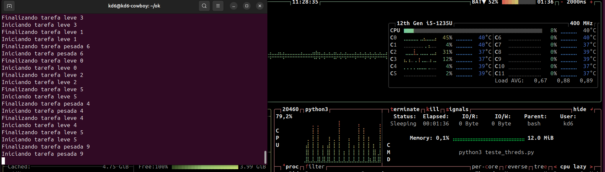
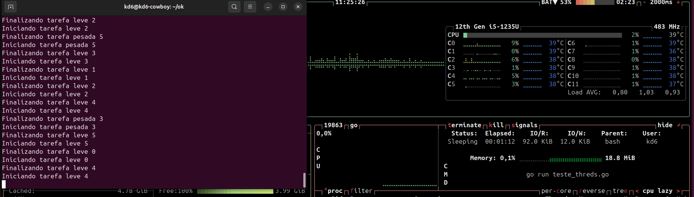
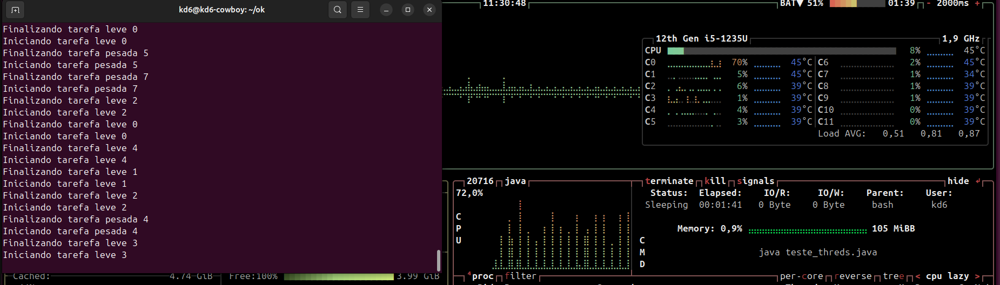

# Estudo sobre processamento, Threds, paralelismo, concorrência.

 
 

### Este estudo nâo significa que é veridico! Estou realizando este estudo por conta própria, buscando entender como de fato é realizado a melhoria de performance, além disso estou buscando compreensão mais sólida com o intuito de construir softwares mais performáticos, flexiveis e de alto desempenho.
### Construido com as linguagens de programação nas quais tive interesse,(Python, Go, Java). Isto não significa que são as melhores do mercado!

### Tópicos que vale a pena buscar entender como funciona:
- Paralelismo e Concorrência
- Sincrono e Assincrono
- Threds e processamento
- Núcleo, cpu, Core

O comportamento de consumo de memória e CPU que foi observado entre Java, Go, e Python é um reflexo das diferenças intrínsecas nas linguagens, seus modelos de execução e como as bibliotecas de tempo de execução e garbage collection (GC) afetam o desempenho e o uso de recursos.

Vou tentar explicar os principais fatores que podem estar influenciando essas diferenças de consumo de memória e CPU nos testes.

## 1. Modelo de Execução e Gerenciamento de Memória

- ### Java:

    Máquina Virtual Java (JVM): O Java usa a JVM, que inclui garbage collection e uma série de overheads devido à própria máquina virtual. A JVM, para ser otimizada, carrega uma quantidade considerável de código e dados para possibilitar a execução do código Java, o que pode resultar em um uso de memória mais alto.

    Garbage Collection: A JVM gerencia a memória automaticamente através da coleta de lixo (GC). O processo de garbage collection pode consumir muita memória temporária e gerar picos de CPU enquanto as fases de coleta de lixo estão ocorrendo, o que pode explicar os picos aleatórios que você observou. Além disso, as JVMs têm configurações para tamanhos de heap (memória disponível para alocação), o que pode aumentar o consumo dependendo de como a JVM foi configurada.

- ### Go:

    Goroutines e Garbage Collection: O Go possui um modelo de concorrência baseado em goroutines, que são leves em comparação com threads tradicionais, consumindo menos memória por goroutine. Além disso, o Go possui um coletor de lixo eficiente, mas sua abordagem de gerenciamento de memória é geralmente mais enxuta em comparação com a JVM. O Go não possui o overhead de uma máquina virtual, e as goroutines são alocadas em pilhas pequenas que podem crescer dinamicamente conforme necessário.

    Consumo mais estável: O Go tende a ter um consumo de memória mais estável porque as goroutines e o gerenciamento de memória são mais eficientes em termos de overhead de tempo de execução. Esse modelo mais "leve" pode resultar em um consumo de memória mais baixo, especialmente em comparação com a JVM.

- ### Python:

    Gerenciamento de Memória e Interpreter (CPython): O Python, especialmente a implementação mais comum (CPython), é um interpretador, e sua memória de heap é gerida de maneira diferente da JVM ou do Go. O garbage collection do Python também pode causar picos de memória, mas de maneira um pouco diferente da JVM, já que o CPython faz gerenciamento de memória por referência.

    Picos de Consumo: O que você observa no Python, com picos de memória aleatórios, pode estar relacionado à forma como o GC do Python funciona, alocando e liberando memória de forma imprevisível. No Python, o controle explícito de memória não é tão rígido quanto em Go, então os objetos em Python podem ficar por mais tempo na memória antes de serem desalocados.

## 2. Tamanho e Eficiência das Threads/Goroutines

  Java usa threads do sistema operacional, que têm overhead considerável por thread. Isso pode ser uma das razões para o alto consumo de memória. Cada thread no Java é gerenciada pelo sistema operacional e, por padrão, tem uma pilha de memória maior, o que aumenta o consumo.

  Go usa goroutines, que são muito mais leves que as threads. Elas têm um consumo de memória muito menor devido ao seu modelo de execução, onde a pilha de uma goroutine começa pequena e cresce dinamicamente à medida que necessário. Isso significa que você pode ter milhares de goroutines rodando com um custo de memória bem mais baixo que o equivalente em threads no Java.

  Python também usa threads do sistema operacional (com o módulo threading), o que pode resultar em um overhead semelhante ao do Java, mas sua implementação de threads não é tão eficiente quanto as goroutines do Go.

## 3. Gerenciamento de Memória e Coleta de Lixo

- #### Java:

    O Java tem um GC que pode ser agressivo em termos de coleta de lixo, especialmente quando você tem muitas instâncias de objetos sendo alocadas e desalocadas rapidamente. Isso pode causar picos de consumo de memória durante a execução, principalmente porque a JVM precisa trabalhar ativamente para liberar memória.

    A JVM também tem tuning de heap, que pode ser configurado para usar mais ou menos memória, dependendo do comportamento do programa.

- #### Go:

    O garbage collector do Go é incremental e muito mais eficiente em comparação com o Java, por isso o Go tende a ter menos picos de memória. O gerenciamento de memória do Go é otimizado para evitar gastos excessivos com GC, resultando em um consumo mais estável.

    Embora o Go tenha coleta de lixo, ele é projetado para ser mais eficiente em termos de uso de memória com um gerenciamento de heap muito mais controlado.

- #### Python:

    O garbage collector do Python pode ser menos eficiente quando se trata de gerenciamento de memória em aplicações com muitos objetos alocados e desalocados rapidamente. O Python tem ciclos de coleta de lixo menos previsíveis, o que pode causar picos de memória aleatórios. Isso pode ser notado durante a execução de programas que alocam muitos objetos, especialmente porque o CPython realiza a coleta de lixo de maneira mais agressiva e com menos controle sobre o tempo de coleta.

## Conclusão

  - O Go é mais eficiente em termos de consumo de memória devido ao seu modelo de execução com goroutines leves e um garbage collector eficiente.
  - O Python tende a ter picos de memória devido ao seu GC mais imprevisível, especialmente quando muitos objetos são criados e destruídos rapidamente.
  - O Java consome mais memória devido ao overhead da JVM e ao gerenciamento de memória mais pesado, com coleta de lixo mais agressiva.

#### Se você quiser reduzir o uso de memória em Java, pode tentar ajustar a tamanho do heap da JVM ou usar configurações de GC diferentes. No Go, o consumo de memória será muito mais eficiente por padrão, mas no Python, você pode tentar forçar o GC em momentos específicos para evitar picos imprevisíveis de memória.

### Imagens dos Testes:
#### Teste com Pytohn

#### Teste com Go

#### Teste com Java

## Como testar?
- #### Requisitos:
    - Btop
    - Python
    - Go
    - Java
- #### Instalar Btop
          apt install btop
  
- #### Roda Btop
          btop
  
- #### Rodar com Python
          python3 teste_threds.py
    
- #### Rodar com Go
          go run teste_threds.go
    
- #### Rodar com Java
          java teste_threds.java
  

### Contribuições

Se você deseja contribuir para este projeto, fique à vontade para criar pull requests ou relatar issues. Melhorias como persistência de dados, maior segurança, e otimizações de desempenho são sempre bem-vindas.

## Autores
- [@Rodrigo_Kelven](https://github.com/Rodrigo-Kelven)

